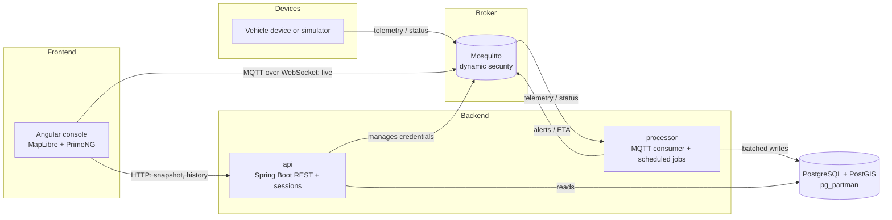

# FleetPulse

**Real-time fleet tracking platform.** Vehicles publish GPS telemetry over MQTT; dispatchers watch the fleet move on a live map, receive geofence and driving alerts, see ETAs, and review trip history and daily activity.

[](https://github.com/HenrySanguna/fleetpulse/actions/workflows/ci.yml)


FleetPulse is an MVP built end to end as a polyglot **Nx monorepo**: a Java/Spring Boot backend split into an HTTP API and an event processor, a pure-Java geospatial core, and a zoneless Angular console. It runs in production entirely on free tiers (Oracle Cloud Always Free, Neon, Cloudflare Pages, GitHub).

The console UI is in Spanish.

---

## Table of contents

- [Features](#features)
- [Architecture](#architecture)
- [How the data flows](#how-the-data-flows)
- [Tech stack](#tech-stack)
- [Repository layout](#repository-layout)
- [Backend deep dive](#backend-deep-dive)
- [Security model](#security-model)
- [Data model](#data-model)
- [REST API](#rest-api)
- [Frontend](#frontend)
- [Testing and CI/CD](#testing-and-cicd)
- [Deployment](#deployment)
- [Running locally](#running-locally)
- [Engineering decisions](#engineering-decisions)
- [Known limitations and roadmap](#known-limitations-and-roadmap)
- [How it was built](#how-it-was-built)

---

## Features

| Area | What it does |
|---|---|
| **Live map** | MapLibre map with every vehicle of the organization, search and filters, a detail panel (motion state, position, last seen, ETA), smooth marker interpolation between samples, a 2-hour track of the selected vehicle (split at implausible jumps) and a connection-status indicator. |
| **Geofences** | Draw polygons or circles (stored as buffered polygons) with `on_enter`, `on_exit` or `on_dwell` rules. Fleet admins create, edit and delete; dispatchers see them read-only. |
| **Alerts** | Inbox with geofence enter/exit/dwell, speeding and excessive-idle alerts, type filter, search, grouping by day, and an acknowledge action that records who attended it and when. |
| **Activity report** | Per-vehicle report over a selectable date range: daily distance chart, trip list, summary KPIs, and the trip that is still in progress. |
| **ETA** | Estimated arrival to an assigned destination, computed from distance, a sinuosity factor and recent average speed. |
| **Offline detection** | A vehicle that stops reporting flips to "Fuera de línea" after 5 minutes, even if its device never sent a Last Will. |
| **Device provisioning** | Per-device MQTT credentials with revoke and rotate, enforced by the broker. |
| **Demo mode** | A bounded simulator drives 10 vehicles around Madrid so the system can be shown without real hardware. |

Roles: `FLEET_ADMIN` and `DISPATCHER`. Every query is scoped to the user's organization (multi-tenant).

---

## Architecture



The backend is two deployable processes built from the same codebase:

- **`processor`** has no HTTP server. It consumes MQTT, writes positions, evaluates geofences and alert rules, computes ETAs, and runs the scheduled jobs (trip segmentation, rollups, partition maintenance).
- **`api`** serves REST to the console, owns authentication and sessions, and provisions MQTT credentials by talking to the broker's dynamic-security API.

The two never depend on each other. They share only `domain` (JPA entities and Flyway migrations) and `geo-core` (pure Java geometry and rules), and the build fails if that rule is broken.

---

## How the data flows

1. **Device to broker.** A device publishes JSON telemetry to `fleet/{orgId}/vehicle/{vehicleId}/telemetry` (QoS 0): `recordedAt`, `lat`, `lon`, and optional `speedKmh`, `heading`, `ignition`. It also publishes a retained `status` message (QoS 1) and registers a **Last Will** so the broker announces `{"online": false}` on an unclean disconnect.
2. **Broker to processor.** The processor subscribes to all telemetry. Each message is parsed and validated, then passed through an implausibility filter (rejects jumps above 300 km/h). Rows go into an in-memory buffer that flushes at 500 rows or every 5 seconds.
3. **Processor to database.** A flush is one `JdbcTemplate.batchUpdate` with `INSERT ... ON CONFLICT DO NOTHING`, so duplicates are dropped by the primary key. The latest state per vehicle is upserted with a guard (`recorded_at < excluded.recorded_at`) so out-of-order messages never overwrite newer state.
4. **Reactions.** For every position newer than the known state, the processor evaluates geofence membership (one PostGIS query), alert rules (speeding, excessive idle) and the ETA. Alerts are stored and also published on `fleet/{orgId}/alerts` (QoS 2); ETAs go to `.../eta`.
5. **Console startup.** The console logs in, requests short-lived read-only MQTT credentials from the API, and opens an MQTT-over-WebSocket connection. It buffers live messages, loads a `GET /api/fleet/state` snapshot, applies it, replays the buffer through a monotonic guard, and then applies live updates. On every reconnect the cycle repeats, with exponential backoff.
6. **Interpolation.** Markers animate toward each new sample over a short window. If samples stop arriving, the marker is dimmed as stale instead of being extrapolated.

---

## Tech stack

| Layer | Technology |
|---|---|
| Language and build | Java 21, Gradle 9 (Kotlin DSL), TypeScript 5.9, Nx 22 |
| Backend | Spring Boot 4.1, Spring Security, Spring Session JDBC, Spring Integration MQTT (Eclipse Paho), springdoc-openapi, Flyway |
| Database | PostgreSQL 18 with PostGIS and pg_partman (Neon in production) |
| Broker | Eclipse Mosquitto 2 with the dynamic-security plugin |
| Frontend | Angular 21 (zoneless, standalone, signals), NgRx SignalStore, PrimeNG 21 (Aura), Tailwind CSS 4, MapLibre GL, MQTT.js |
| API contract | OpenAPI generated by the backend, TypeScript client generated from it |
| Testing | JUnit 5, Testcontainers (real PostGIS and Mosquitto), Vitest, Playwright |
| Infra and CI | Docker, Caddy, GitHub Actions, GHCR, Cloudflare Pages |

---

## Repository layout

```
.
├── backend/
│   ├── geo-core/     Pure Java: haversine, bearing, track simplification, motion
│   │                 detection, geofence hysteresis, trip rules. No Spring, no JPA.
│   ├── domain/       JPA entities and Flyway migrations V1..V15.
│   ├── api/          REST API, authentication, MQTT credential provisioning.
│   ├── processor/    MQTT consumers, engines, scheduled jobs, device simulator.
│   └── buildSrc/     Build-time guard that enforces the module dependency rules.
├── apps/
│   ├── console/      Angular app (live map, geofences, alerts, activity report).
│   └── console-e2e/  Playwright end-to-end tests.
├── libs/
│   ├── console-ui/   Presentational PrimeNG components (no state).
│   └── api-client/   TypeScript client generated from the OpenAPI document.
├── docker/           Mosquitto, Caddy, PostGIS image, demo seed and entrypoints.
├── scripts/          API client generation and drift check.
├── openspec/         Spec-driven development artifacts (proposals, specs, archive).
└── .github/workflows CI/CD pipeline.
```

**Dependency rules enforced at build time**

- `api` and `processor` depend on `domain` and `geo-core`, never on each other (`verifyBackendDependencyDirection`).
- `geo-core` must not depend on Spring or JPA (`verifyNoSpringOrJpaDependencies`) and carries a 100% branch-coverage gate.

---

## Backend deep dive

### Motion detection
Speed thresholds with a stability window turn raw speed into three states: `MOVING`, `IDLING` (engine on) and `STOPPED`. Defaults are 5 km/h to stop, 12 km/h to start, and 30 s of stable readings. Streak start times are persisted so state survives restarts.

### Trip segmentation
A scheduled job (every 5 minutes) walks persisted positions per vehicle. A not-moving run longer than the organization's stop threshold (default 5 minutes, configurable per organization) closes the trip at the last moving position. Closed trips are stored with distance, duration, idle time, and max and average speed, and are idempotent through a unique constraint. The API computes the still-open trip at read time using the same rules, which live in `geo-core` so both processes agree.

### Rollups
Hourly and daily aggregates (`vehicle_hourly`, `vehicle_daily`) are recomputed every 15 minutes over the last 24 closed hours. The daily recompute always rebuilds whole UTC days from the hourly rows, so a day that is only partly inside the window is never overwritten with a partial total.

### Geofences
Containment is a single GiST-indexed PostGIS query per batch (a test asserts there is no sequential scan). Membership changes go through **hysteresis**: the exit test uses a buffered boundary (15 m) and a transition is confirmed after 3 consecutive readings or 30 seconds, which stops a vehicle on the boundary from flapping. Dwell alerts fire once per stay. Fence state is persisted and survives restarts. Circles are stored as buffered polygons, so there is one evaluation path.

### Alerts
Speeding (default limit 100 km/h) and excessive idle (10 minutes). An **alert silence** engine fires on a fresh episode, then re-fires only after a quiet period while the condition persists, so a vehicle crossing a boundary repeatedly does not flood the inbox. Alerts are stored, published on MQTT at QoS 2, and acknowledged from the console with an audit trail.

### ETA
Straight-line distance multiplied by a sinuosity factor, divided by the recent average speed (with a fallback speed and a safety margin). It is not road routing.

### Operations
- Partition maintenance for the `positions` table runs from a scheduled job that calls pg_partman explicitly, because serverless Postgres suspends compute and cannot rely on a background worker.
- The processor publishes a retained heartbeat every 30 seconds; the API health indicator reports the processor as up while the heartbeat is fresh.
- Scheduled jobs are **idle-gated**: when a run provably cannot change anything, it is skipped, so the serverless database can scale to zero.

---

## Security model

- **Sessions:** form login with server-side sessions stored in Postgres. The cookie is `HttpOnly`, `Secure` and `SameSite=None` because the console and the API are on different sites (a documented deviation).
- **CSRF:** a session-bound token delivered in the body of `GET /api/csrf` and sent by the console as `X-CSRF-TOKEN`.
- **Passwords:** Argon2.
- **Roles:** `FLEET_ADMIN` and `DISPATCHER`, checked with method-level security.
- **Multi-tenancy:** every query is scoped to the caller's organization. A resource of another organization returns `404`, not `403`.
- **Deactivated users** lose access on their next request.
- **MQTT authorization is enforced in the broker, not in application code:**
  - Each device gets a username and a role that can publish only its own vehicle's topics.
  - Each browser session gets short-lived credentials (5 minutes in production) that are subscribe-only on its organization's topics.
  - Revoking a device force-disconnects its session.
  - Dedicated tests prove that organizations and devices cannot read or write each other's topics.

---

## Data model

Schema is owned exclusively by Flyway (`ddl-auto: validate`).

| Table | Purpose |
|---|---|
| `organizations`, `users` | Tenants and dispatcher accounts (role, active flag). |
| `vehicles`, `devices`, `mqtt_credentials` | Fleet, devices, and per-device or per-user broker credentials with expiry and revocation. |
| `positions` | Telemetry history. **Partitioned by week** with pg_partman, 90-day retention, `GEOGRAPHY(Point)`; primary key `(vehicle_id, recorded_at)` doubles as the dedup key. |
| `vehicle_state` | Latest position, motion state, online flag and speed streaks per vehicle. |
| `geofences`, `vehicle_fence_state` | Polygon areas (GiST-indexed, soft delete) and per-vehicle membership state. |
| `trips` | Closed trips with metrics, unique per `(vehicle_id, started_at)`. |
| `vehicle_destinations` | Assigned destination and its latest ETA. |
| `alerts`, `alert_silence_state` | Unified alerts (with acknowledge audit) and their silence windows. |
| `vehicle_hourly`, `vehicle_daily` | Rollups used by the activity report (UTC days). |
| Spring Session tables | Server-side sessions. |

Spatial logic always uses PostGIS `ST_*` functions in SQL, never geometry math over loaded rows in Java.

---

## REST API

Interactive documentation is available through springdoc (`/v3/api-docs`, Swagger UI).

| Method and path | Role |
|---|---|
| `POST /login`, `POST /logout`, `GET /api/csrf` | public / session |
| `GET /api/dispatchers/me` | authenticated |
| `GET /api/fleet/state` | authenticated |
| `GET /api/vehicles/{id}/track` | authenticated |
| `GET /api/vehicles/{id}/activity-report?from&to` | authenticated |
| `PUT`, `DELETE /api/vehicles/{id}/destination` | authenticated |
| `GET /api/alerts`, `PATCH /api/alerts/{id}/acknowledge` | authenticated |
| `GET /api/geofences`, `GET /api/geofences/{id}` | authenticated |
| `POST`, `PUT`, `DELETE /api/geofences` | `FLEET_ADMIN` |
| `GET /api/mqtt/credentials` | authenticated (browser MQTT credentials) |
| `POST`, `DELETE`, rotate on `/api/devices/{id}/mqtt-credentials` | `FLEET_ADMIN` |
| `GET /actuator/health`, `/actuator/info` | public |

**Contract-first client.** The API publishes its OpenAPI document and `libs/api-client` is generated from it (`npm run generate:api-client`). It is never edited by hand, and a CI step regenerates it and fails the build if the committed client has drifted (`npm run generate:api-client:check`).

---

## Frontend

- **Zoneless Angular 21** with standalone components, signals, `OnPush` and lazy-loaded routes.
- **State:** NgRx SignalStore for the live fleet, alerts, geofences, activity report and auth; `httpResource` for request-driven data.
- **Container / presentational split:** `apps/console` owns state and orchestration; `libs/console-ui` holds stateless PrimeNG widgets.
- **Live layer:** MQTT over WebSocket with credential renewal before expiry, snapshot-plus-buffer resync on every reconnect, and a pure interpolation engine driven by `requestAnimationFrame`.
- **Theme:** PrimeNG Aura assembled from only the components in use (about 120 kB saved), Tailwind CSS 4, a small design-token layer.
- **Responsive shell:** navigation rail on desktop, drawer on small screens.

---

## Testing and CI/CD

The test strategy favors realism over mocks: backend tests run against a **real PostGIS container and a real Mosquitto with dynamic security** through Testcontainers.

| Module | Tests |
|---|---|
| geo-core | 79 |
| domain | 48 |
| api | 119 |
| processor | 182 |
| console (Vitest) | 305 |
| console-ui (Vitest) | 21 |
| console-e2e (Playwright) | 3 specs |

Highlights: query-plan tests that assert spatial queries use the GiST index and the activity report never scans positions; idempotency and out-of-order tests for MQTT consumers; cross-organization and cross-device isolation tests at the broker level.

**Pipeline** (`.github/workflows/ci.yml`):

1. `affected`: `nx affected -t lint test build` plus the API-client drift check.
2. `docker-and-compose-smoke`: build the image, start the real stack, and assert the API goes from down to up once the processor heartbeat arrives.
3. `deploy-oracle` (main only): build a `linux/arm64` image, push it to GHCR and roll it out on the VM.
4. `verify-deploy`: compare the deployed commit SHA from `/actuator/info` against the pushed one and check the processor heartbeat.
5. `deploy-console`: build the Angular app and publish it to Cloudflare Pages.

---

## Deployment

Everything runs on free tiers:

| Component | Where |
|---|---|
| Console | Cloudflare Pages |
| API, processor, broker, reverse proxy | One Oracle Cloud Always Free ARM VM, Docker Compose |
| Database | Neon (serverless PostgreSQL with PostGIS) |
| Images | GitHub Container Registry |

A single backend image contains both jars; the entrypoint picks `api`, `processor` or `simulator` from `FLEETPULSE_PROCESS`, so both processes always ship with the same `domain` and `geo-core` build. Caddy terminates TLS and proxies both the API and the MQTT WebSocket. Because Neon scales to zero when idle, the idle-gated jobs, the short Hikari idle timeout, a health check that does not touch the database, and the time-bounded demo simulator all exist to let it sleep.

---

## Running locally

Prerequisites: Java 21, Node 24, Docker.

```bash
# 1. Install JS dependencies
npm ci

# 2. Start PostGIS (with pg_partman) and Mosquitto (with dynamic security)
docker compose up -d --wait

# 3. Start the backend (profile `local` carries dev-only credentials)
cd backend
./gradlew :api:bootRun --args='--spring.profiles.active=local --server.port=8099'
./gradlew :processor:bootRun --args='--spring.profiles.active=local'

# 4. Start the console (expects the API on http://localhost:8099)
cd ..
npx nx serve console
```

Notes:

- The Nx dev server cannot render the map because of a MapLibre worker chunk issue. For anything that needs the map, use the production build (`npx nx build console --configuration=production`), which is also what the Playwright suite serves.
- A demo fleet can be seeded with `docker/demo/seed-demo-fleet.sql`, and the device simulator is started with `./gradlew :processor:runDeviceSimulator` (configured with `SIMULATOR_*` environment variables).
- There is no user-provisioning endpoint yet, so dispatcher accounts are inserted with SQL (the password column expects an Argon2 hash).

Common commands:

```bash
npx nx affected -t lint test build     # what CI runs
cd backend && ./gradlew test build     # full backend, needs Docker
npm run generate:api-client            # regenerate the TypeScript client
npm run generate:api-client:check      # fail if the client drifted
```

---

## Engineering decisions

- **Batched, idempotent ingestion.** Writes go through `JdbcTemplate.batchUpdate`, never JPA; the primary key is the dedup mechanism, so redelivery is harmless.
- **PostGIS does the geometry.** Containment and buffering are `ST_*` queries backed by a GiST index. Java only does point-to-point math.
- **Hysteresis on geofences and an alert silence window**, so noisy GPS near a boundary does not produce noisy alerts.
- **Derive instead of poll.** Online status is computed at read time from the last report. No extra job, no extra database wake-up.
- **Shared rules in a pure module.** Trip segmentation and motion rules live in `geo-core`, so the processor (writes) and the API (in-progress trip) can never disagree.
- **Architecture enforced by the build**, not by convention.
- **Authorization at the broker.** A compromised browser credential can only read its own organization's topics.
- **Contract-first API client** with a CI drift gate.
- **Realistic tests.** Real PostGIS and a real broker instead of mocks.
- **Free-tier engineering.** Scale-to-zero friendly jobs, explicit partition maintenance, and a bounded demo simulator.

---

## Known limitations and roadmap

- The `offline` alert type exists in the schema and the console filter, but no emitter is implemented yet.
- ETA is straight-line distance with a sinuosity factor, not road routing.
- The console shows alerts and ETAs from HTTP snapshots; it does not subscribe to the live alert and ETA topics yet.
- No console UI to assign a destination (the endpoint exists).
- No user or organization management (planned: admins create dispatcher accounts from the console).
- Speed limit and idle threshold are global settings; only the trip stop threshold is per organization.
- Days are UTC; there is no per-organization time zone.
- The UI is Spanish only, with no i18n layer and no dark mode.
- Mobile layout is functional but not polished.

---

## How it was built

The project followed **spec-driven development** with OpenSpec: seven changes (bootstrap, geo-core, fleet auth, telemetry ingest, live map, geofencing, trips/ETA/alerts), each with a proposal, specs, design and task breakdown, archived under `openspec/changes/archive/`. Work was shipped as small, reviewable work units, with tests alongside behavior.

After the first production deploy, several rounds of QA against the live system (browser-driven, with both roles) drove fixes such as cross-site cookies and CSRF, the in-progress trip, the alert silence window, an offline-detection gap and a daily-rollup bug found by reconciling the report against the raw data.

About 250 commits and 97 pull requests over five weeks.

---

## License

No license has been chosen yet. Until one is added, all rights are reserved by the author.
